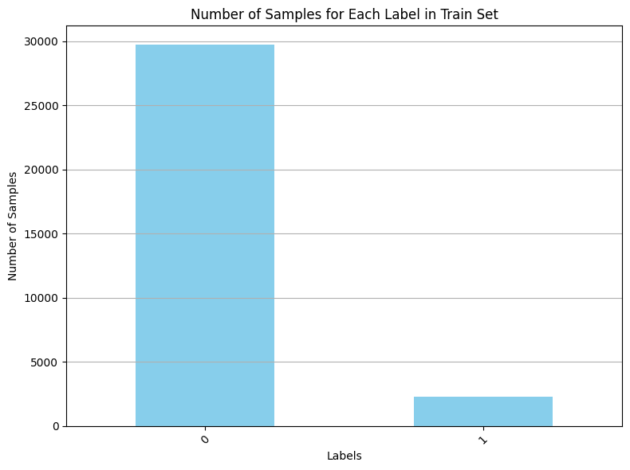
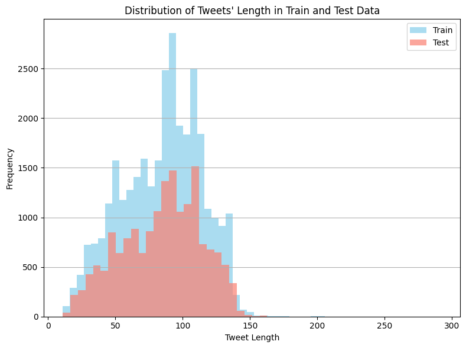
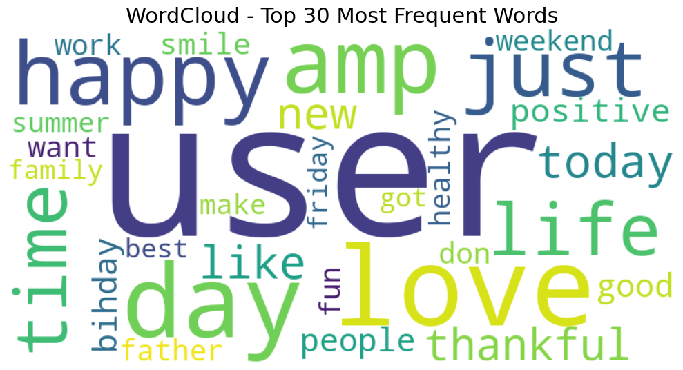
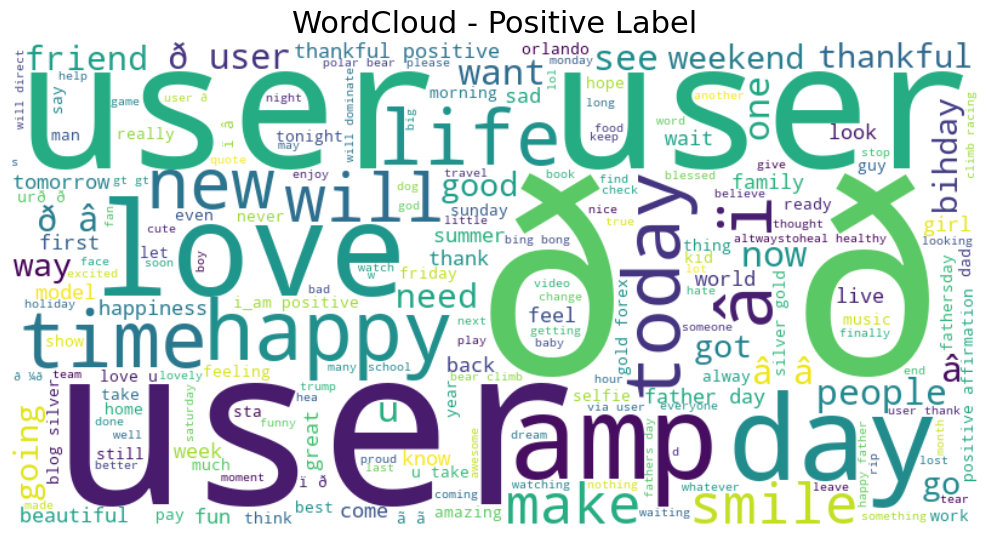
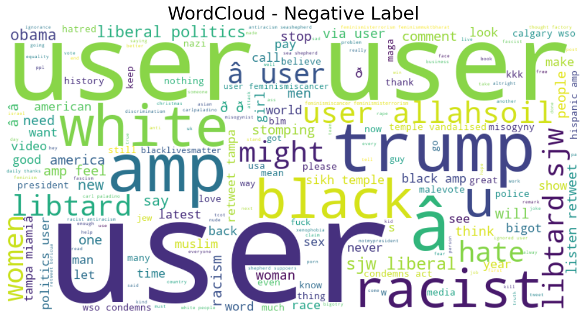
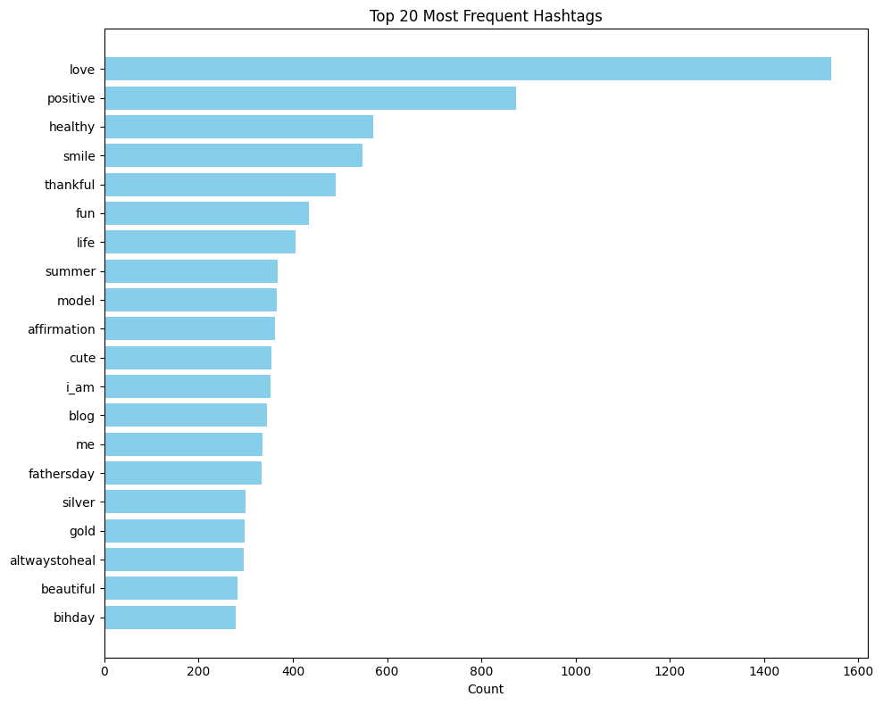
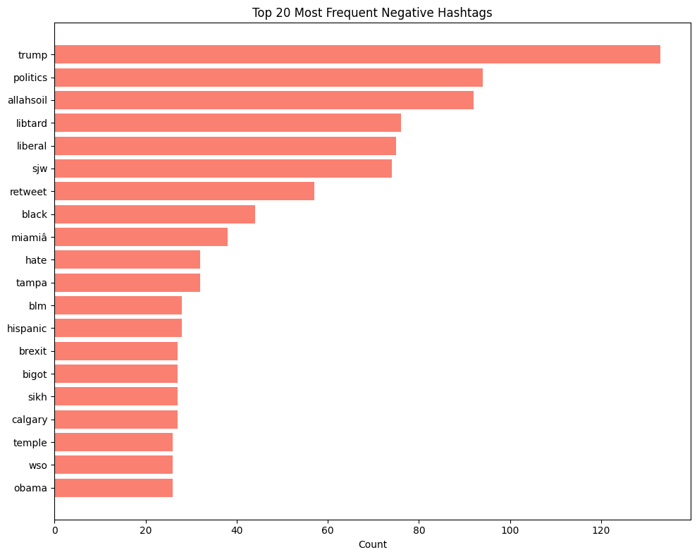
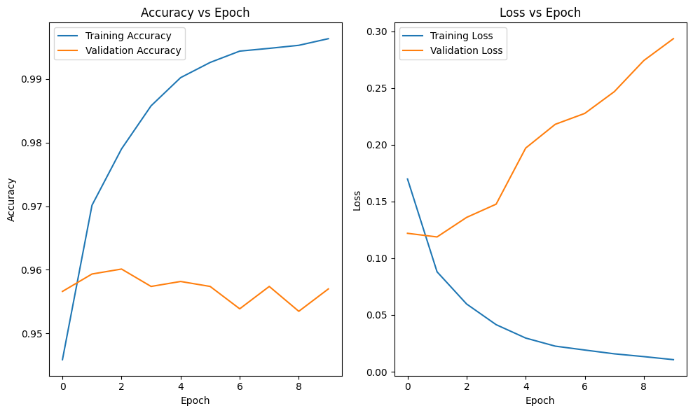

# Assignment 4. Deep Learning

*Foundations of Data Science*  
*Dr. Khalaj (Fall 2023)*  

*For questions 1 refer to @alino_9 on Telegram.*

### Description  
This homework consists of four questions, each aimed at one category in the world of Deep Learning.   
1. Getting familiarized with sentiment analysis (A subject also covered in the course project).
   
2. Multi-layer perceptron (MLP). 
   
3. Convolutional Neural Networks (CNN).
   
4. Variational Autoencoders (VAE).

### Information  
Complete the information box below.


```python
full_name = 'Ali Nikkhah'
student_id = '99102445'
```

### Note
The questions are not necessarily in order of difficulty. You are obligated to answer **3 out of 4** questions. The fourth question is optional and is considered as bonus.

## 1 Twitter Sentiment Analysis


```python
# Import the necessary libraries
import pandas as pd
import matplotlib.pyplot as plt
!ls 
```

    HW-04-01.ipynb   HW-04-03.ipynb   test-tweets.csv
    HW-04-02.ipynb   HW-04-04.ipynb   train-tweets.csv


### 1.1 Load and Visualize Dataset


```python
import pandas as pd

# Load the train and test datasets from CSV files
train = pd.read_csv('train-tweets.csv')
test = pd.read_csv('test-tweets.csv')

# Print the length of the train and test datasets
print("Length of Train Dataset:", len(train))
print("Length of Test Dataset:", len(test))

```

    Length of Train Dataset: 31962
    Length of Test Dataset: 17197


```python
import pandas as pd

# Load the train and test datasets from CSV files
train = pd.read_csv('train-tweets.csv')
test = pd.read_csv('test-tweets.csv')

# Display the first few samples from the train set
print("Samples from Train Set:")
print(train.head(30))

# Display the first few samples from the test set
print("\nSamples from Test Set:")
print(test.head(30))

```

    Samples from Train Set:
        id  label                                              tweet
    0    1      0   @user when a father is dysfunctional and is s...
    1    2      0  @user @user thanks for #lyft credit i can't us...
    2    3      0                                bihday your majesty
    3    4      0  #model   i love u take with u all the time in ...
    4    5      0             factsguide: society now    #motivation
    5    6      0  [2/2] huge fan fare and big talking before the...
    6    7      0   @user camping tomorrow @user @user @user @use...
    7    8      0  the next school year is the year for exams.ðŸ˜...
    8    9      0  we won!!! love the land!!! #allin #cavs #champ...
    9   10      0   @user @user welcome here !  i'm   it's so #gr...
    10  11      0   ↝ #ireland consumer price index (mom) climb...
    11  12      0  we are so selfish. #orlando #standwithorlando ...
    12  13      0  i get to see my daddy today!!   #80days #getti...
    13  14      1  @user #cnn calls #michigan middle school 'buil...
    14  15      1  no comment!  in #australia   #opkillingbay #se...
    15  16      0  ouch...junior is angry😐#got7 #junior #yugyo...
    16  17      0  i am thankful for having a paner. #thankful #p...
    17  18      1                             retweet if you agree! 
    18  19      0  its #friday! 😀 smiles all around via ig use...
    19  20      0  as we all know, essential oils are not made of...
    20  21      0  #euro2016 people blaming ha for conceded goal ...
    21  22      0  sad little dude..   #badday #coneofshame #cats...
    22  23      0  product of the day: happy man #wine tool  who'...
    23  24      1    @user @user lumpy says i am a . prove it lumpy.
    24  25      0   @user #tgif   #ff to my #gamedev #indiedev #i...
    25  26      0  beautiful sign by vendor 80 for $45.00!! #upsi...
    26  27      0   @user all #smiles when #media is   !! 😜ðŸ˜...
    27  28      0  we had a great panel on the mediatization of t...
    28  29      0        happy father's day @user 💓💓💓💓  
    29  30      0  50 people went to nightclub to have a good nig...
    
    Samples from Test Set:
           id                                              tweet
    0   31963  #studiolife #aislife #requires #passion #dedic...
    1   31964   @user #white #supremacists want everyone to s...
    2   31965  safe ways to heal your #acne!!    #altwaystohe...
    3   31966  is the hp and the cursed child book up for res...
    4   31967    3rd #bihday to my amazing, hilarious #nephew...
    5   31968                        choose to be   :) #momtips 
    6   31969  something inside me dies 💦💿✨  eyes nes...
    7   31970  #finished#tattoo#inked#ink#loveit❤️ #❤ï¸...
    8   31971   @user @user @user i will never understand why...
    9   31972  #delicious   #food #lovelife #capetown mannaep...
    10  31973  1000dayswasted - narcosis infinite ep.. make m...
    11  31974  one of the world's greatest spoing events   #l...
    12  31975  half way through the website now and #allgoing...
    13  31976  good food, good life , #enjoy and   🙌🍕ðŸ...
    14  31977  i'll stand behind this #guncontrolplease   #se...
    15  31978  i ate,i ate and i ate...😀😊   #jamaisasth...
    16  31979   @user got my @user limited edition rain or sh...
    17  31980  &amp; #love &amp; #hugs &amp; #kisses too! how...
    18  31981  👭🌞💖 #girls   #sun #fave @ london, uni...
    19  31982  thought factory: bbc neutrality on right wing ...
    20  31983  hey guys tommorow is the last day of my exams ...
    21  31984   @user @user  @user  #levyrroni #recuerdos mem...
    22  31985  my mind is like 🎉💃🏽🏀 but my body l...
    23  31986  never been this down on myself in my entire li...
    24  31987  check  twitterww - trends: "trending worldwide...
    25  31988  i thought i saw a mermaid!!! #ceegee  #smcr   ...
    26  31989              chick gets fucked hottest naked lady 
    27  31990  happy bday lucy✨✨🎈 xoxo #love #beautifu...
    28  31991   haroldfriday have a weekend filled with sunbe...
    29  31992  @user @user tried that! but nothing - will try...


```python
# Import the necessary libraries
import pandas as pd
import matplotlib.pyplot as plt
!ls 
```

    HW-04-01.ipynb   HW-04-03.ipynb   test-tweets.csv
    HW-04-02.ipynb   HW-04-04.ipynb   train-tweets.csv


```python
import pandas as pd

# Load the train and test datasets from CSV files
train = pd.read_csv('train-tweets.csv')
test = pd.read_csv('test-tweets.csv')

# Create a new column 'is_tweet_empty' based on whether 'tweet' column is empty in train dataset
train['is_tweet_empty'] = train['tweet'].apply(lambda x: True if pd.isnull(x) or x.strip() == '' else False)

# Create a new column 'is_tweet_empty' based on whether 'tweet' column is empty in test dataset
test['is_tweet_empty'] = test['tweet'].apply(lambda x: True if pd.isnull(x) or x.strip() == '' else False)

# Count the number of empty tweets in train dataset
num_empty_tweets_train = train['is_tweet_empty'].sum()

# Count the number of empty tweets in test dataset
num_empty_tweets_test = test['is_tweet_empty'].sum()

# Displaying the result for the train dataset
print("Train Dataset - Check for Empty Tweets:")
print(train[['tweet', 'is_tweet_empty']])

# Displaying the result for the test dataset
print("\nTest Dataset - Check for Empty Tweets:")
print(test[['tweet', 'is_tweet_empty']])

# Display the counts of empty tweets
print("\nNumber of Empty Tweets in Train Dataset:", num_empty_tweets_train)
print("Number of Empty Tweets in Test Dataset:", num_empty_tweets_test)

```

    Train Dataset - Check for Empty Tweets:
                                                       tweet  is_tweet_empty
    0       @user when a father is dysfunctional and is s...           False
    1      @user @user thanks for #lyft credit i can't us...           False
    2                                    bihday your majesty           False
    3      #model   i love u take with u all the time in ...           False
    4                 factsguide: society now    #motivation           False
    ...                                                  ...             ...
    31957  ate @user isz that youuu?😍😍😍😍😍ð...           False
    31958    to see nina turner on the airwaves trying to...           False
    31959  listening to sad songs on a monday morning otw...           False
    31960  @user #sikh #temple vandalised in in #calgary,...           False
    31961                   thank you @user for you follow             False
    
    [31962 rows x 2 columns]
    
    Test Dataset - Check for Empty Tweets:
                                                       tweet  is_tweet_empty
    0      #studiolife #aislife #requires #passion #dedic...           False
    1       @user #white #supremacists want everyone to s...           False
    2      safe ways to heal your #acne!!    #altwaystohe...           False
    3      is the hp and the cursed child book up for res...           False
    4        3rd #bihday to my amazing, hilarious #nephew...           False
    ...                                                  ...             ...
    17192  thought factory: left-right polarisation! #tru...           False
    17193  feeling like a mermaid 😘 #hairflip #neverre...           False
    17194  #hillary #campaigned today in #ohio((omg)) &am...           False
    17195  happy, at work conference: right mindset leads...           False
    17196  my   song "so glad" free download!  #shoegaze ...           False
    
    [17197 rows x 2 columns]
    
    Number of Empty Tweets in Train Dataset: 0
    Number of Empty Tweets in Test Dataset: 0


```python
import pandas as pd

# Load the train dataset from the CSV file
train = pd.read_csv('train-tweets.csv')

# Assuming 'sentiment' is the column indicating sentiment (positive/negative)
negative_comments = train[train['label'] == 1]

# Display 10 negative comments
print("10 Negative Comments from Train Set:")
print(negative_comments)

```

    10 Negative Comments from Train Set:
              id  label                                              tweet
    13        14      1  @user #cnn calls #michigan middle school 'buil...
    14        15      1  no comment!  in #australia   #opkillingbay #se...
    17        18      1                             retweet if you agree! 
    23        24      1    @user @user lumpy says i am a . prove it lumpy.
    34        35      1  it's unbelievable that in the 21st century we'...
    ...      ...    ...                                                ...
    31934  31935      1  lady banned from kentucky mall. @user  #jcpenn...
    31946  31947      1  @user omfg i'm offended! i'm a  mailbox and i'...
    31947  31948      1  @user @user you don't have the balls to hashta...
    31948  31949      1   makes you ask yourself, who am i? then am i a...
    31960  31961      1  @user #sikh #temple vandalised in in #calgary,...
    
    [2242 rows x 3 columns]


```python
import pandas as pd

# Load the train dataset from the CSV file
train = pd.read_csv('train-tweets.csv')

# Assuming 'sentiment' is the column indicating sentiment (positive/negative)
negative_comments = train[train['label'] == 0]

# Display 10 negative comments
print("10 Negative Comments from Train Set:")
print(negative_comments)

```

    10 Negative Comments from Train Set:
              id  label                                              tweet
    0          1      0   @user when a father is dysfunctional and is s...
    1          2      0  @user @user thanks for #lyft credit i can't us...
    2          3      0                                bihday your majesty
    3          4      0  #model   i love u take with u all the time in ...
    4          5      0             factsguide: society now    #motivation
    ...      ...    ...                                                ...
    31956  31957      0  off fishing tomorrow @user carnt wait first ti...
    31957  31958      0  ate @user isz that youuu?😍😍😍😍😍ð...
    31958  31959      0    to see nina turner on the airwaves trying to...
    31959  31960      0  listening to sad songs on a monday morning otw...
    31961  31962      0                   thank you @user for you follow  
    
    [29720 rows x 3 columns]


```python
import pandas as pd
import matplotlib.pyplot as plt

# Load the train dataset from the CSV file
train = pd.read_csv('train-tweets.csv')

# Assuming 'label' is the column containing the labels/categories
label_counts = train['label'].value_counts()

# Plotting the bar plot
plt.figure(figsize=(8, 6))
label_counts.plot(kind='bar', color='skyblue')
plt.title('Number of Samples for Each Label in Train Set')
plt.xlabel('Labels')
plt.ylabel('Number of Samples')
plt.xticks(rotation=45)  # Rotating x-axis labels for better readability if needed
plt.grid(axis='y')  # Adding grid lines along the y-axis
plt.tight_layout()
plt.show()

```


    

    


```python
import pandas as pd
import matplotlib.pyplot as plt

# Load the train and test datasets from the CSV files
train = pd.read_csv('train-tweets.csv')
test = pd.read_csv('test-tweets.csv')

# Assuming 'text' is the column containing the tweet text
train['tweet_length'] = train['tweet'].apply(len)
test['tweet_length'] = test['tweet'].apply(len)

# Plotting the distribution of tweet lengths for train and test datasets
plt.figure(figsize=(8, 6))

plt.hist(train['tweet_length'], bins=50, alpha=0.7, label='Train', color='skyblue')
plt.hist(test['tweet_length'], bins=50, alpha=0.7, label='Test', color='salmon')

plt.title('Distribution of Tweets\' Length in Train and Test Data')
plt.xlabel('Tweet Length')
plt.ylabel('Frequency')
plt.legend()
plt.grid(axis='y')

plt.tight_layout()
plt.show()

```


    

    


```python
import pandas as pd

# Load the train and test datasets from the CSV files
train = pd.read_csv('train-tweets.csv')
test = pd.read_csv('test-tweets.csv')

# Adding a column 'len' to represent the length of the tweet text
train['len'] = train['tweet'].apply(len)
test['len'] = test['tweet'].apply(len)

```


```python
train.head(5)
```


<div>
<style scoped>
    .dataframe tbody tr th:only-of-type {
        vertical-align: middle;
    }

    .dataframe tbody tr th {
        vertical-align: top;
    }

    .dataframe thead th {
        text-align: right;
    }
</style>
<table border="1" class="dataframe">
  <thead>
    <tr style="text-align: right;">
      <th></th>
      <th>id</th>
      <th>label</th>
      <th>tweet</th>
      <th>len</th>
    </tr>
  </thead>
  <tbody>
    <tr>
      <th>0</th>
      <td>1</td>
      <td>0</td>
      <td>@user when a father is dysfunctional and is s...</td>
      <td>102</td>
    </tr>
    <tr>
      <th>1</th>
      <td>2</td>
      <td>0</td>
      <td>@user @user thanks for #lyft credit i can't us...</td>
      <td>122</td>
    </tr>
    <tr>
      <th>2</th>
      <td>3</td>
      <td>0</td>
      <td>bihday your majesty</td>
      <td>21</td>
    </tr>
    <tr>
      <th>3</th>
      <td>4</td>
      <td>0</td>
      <td>#model   i love u take with u all the time in ...</td>
      <td>86</td>
    </tr>
    <tr>
      <th>4</th>
      <td>5</td>
      <td>0</td>
      <td>factsguide: society now    #motivation</td>
      <td>39</td>
    </tr>
  </tbody>
</table>
</div>


```python
train.groupby('label').describe()
```


<div>
<style scoped>
    .dataframe tbody tr th:only-of-type {
        vertical-align: middle;
    }

    .dataframe tbody tr th {
        vertical-align: top;
    }

    .dataframe thead tr th {
        text-align: left;
    }

    .dataframe thead tr:last-of-type th {
        text-align: right;
    }
</style>
<table border="1" class="dataframe">
  <thead>
    <tr>
      <th></th>
      <th colspan="8" halign="left">id</th>
      <th colspan="8" halign="left">len</th>
    </tr>
    <tr>
      <th></th>
      <th>count</th>
      <th>mean</th>
      <th>std</th>
      <th>min</th>
      <th>25%</th>
      <th>50%</th>
      <th>75%</th>
      <th>max</th>
      <th>count</th>
      <th>mean</th>
      <th>std</th>
      <th>min</th>
      <th>25%</th>
      <th>50%</th>
      <th>75%</th>
      <th>max</th>
    </tr>
    <tr>
      <th>label</th>
      <th></th>
      <th></th>
      <th></th>
      <th></th>
      <th></th>
      <th></th>
      <th></th>
      <th></th>
      <th></th>
      <th></th>
      <th></th>
      <th></th>
      <th></th>
      <th></th>
      <th></th>
      <th></th>
    </tr>
  </thead>
  <tbody>
    <tr>
      <th>0</th>
      <td>29720.0</td>
      <td>15974.454441</td>
      <td>9223.783469</td>
      <td>1.0</td>
      <td>7981.75</td>
      <td>15971.5</td>
      <td>23965.25</td>
      <td>31962.0</td>
      <td>29720.0</td>
      <td>84.328634</td>
      <td>29.566484</td>
      <td>11.0</td>
      <td>62.0</td>
      <td>88.0</td>
      <td>107.0</td>
      <td>274.0</td>
    </tr>
    <tr>
      <th>1</th>
      <td>2242.0</td>
      <td>16074.896075</td>
      <td>9267.955758</td>
      <td>14.0</td>
      <td>8075.25</td>
      <td>16095.0</td>
      <td>24022.00</td>
      <td>31961.0</td>
      <td>2242.0</td>
      <td>90.187779</td>
      <td>27.375502</td>
      <td>12.0</td>
      <td>69.0</td>
      <td>96.0</td>
      <td>111.0</td>
      <td>152.0</td>
    </tr>
  </tbody>
</table>
</div>


```python
import pandas as pd
from sklearn.feature_extraction.text import CountVectorizer
import matplotlib.pyplot as plt

# Load the train dataset from the CSV file
train = pd.read_csv('train-tweets.csv')

# Assuming 'tweet' is the column containing the tweet text
text_data = train['tweet'].astype(str)

# Initialize CountVectorizer to count the words
count_vectorizer = CountVectorizer(stop_words='english')

# Fit and transform the text data to get the word counts
word_counts = count_vectorizer.fit_transform(text_data)

# Get the vocabulary of words
words = count_vectorizer.get_feature_names_out()

# Sum up the word counts
word_counts = word_counts.sum(axis=0)

# Create a DataFrame with words and their frequencies
word_freq = [(word, word_counts[0, idx]) for word, idx in count_vectorizer.vocabulary_.items()]
word_freq = sorted(word_freq, key=lambda x: x[1], reverse=True)

# Get the top 30 most frequent words
top_30_words = word_freq[:30]

# Convert to a DataFrame
frequency = pd.DataFrame(top_30_words, columns=['word', 'freq'])

# Plotting the top 30 most frequent words
frequency.plot(x='word', y='freq', kind='bar', figsize=(15, 7), color='blue')
plt.title("Top 30 Most Frequently Occurring Words")
plt.xlabel("Words")
plt.ylabel("Frequency")
plt.xticks(rotation=45)
plt.tight_layout()
plt.show()

```


    

    


```python
!pip install wordcloud
```

    Requirement already satisfied: wordcloud in /Library/Frameworks/Python.framework/Versions/3.11/lib/python3.11/site-packages (1.9.3)
    Requirement already satisfied: numpy>=1.6.1 in /Library/Frameworks/Python.framework/Versions/3.11/lib/python3.11/site-packages (from wordcloud) (1.26.2)
    Requirement already satisfied: pillow in /Library/Frameworks/Python.framework/Versions/3.11/lib/python3.11/site-packages (from wordcloud) (10.0.0)
    Requirement already satisfied: matplotlib in /Library/Frameworks/Python.framework/Versions/3.11/lib/python3.11/site-packages (from wordcloud) (3.7.2)
    Requirement already satisfied: contourpy>=1.0.1 in /Library/Frameworks/Python.framework/Versions/3.11/lib/python3.11/site-packages (from matplotlib->wordcloud) (1.1.0)
    Requirement already satisfied: cycler>=0.10 in /Library/Frameworks/Python.framework/Versions/3.11/lib/python3.11/site-packages (from matplotlib->wordcloud) (0.11.0)
    Requirement already satisfied: fonttools>=4.22.0 in /Library/Frameworks/Python.framework/Versions/3.11/lib/python3.11/site-packages (from matplotlib->wordcloud) (4.42.1)
    Requirement already satisfied: kiwisolver>=1.0.1 in /Library/Frameworks/Python.framework/Versions/3.11/lib/python3.11/site-packages (from matplotlib->wordcloud) (1.4.5)
    Requirement already satisfied: packaging>=20.0 in /Library/Frameworks/Python.framework/Versions/3.11/lib/python3.11/site-packages (from matplotlib->wordcloud) (23.1)
    Requirement already satisfied: pyparsing<3.1,>=2.3.1 in /Library/Frameworks/Python.framework/Versions/3.11/lib/python3.11/site-packages (from matplotlib->wordcloud) (3.0.9)
    Requirement already satisfied: python-dateutil>=2.7 in /Library/Frameworks/Python.framework/Versions/3.11/lib/python3.11/site-packages (from matplotlib->wordcloud) (2.8.2)
    Requirement already satisfied: six>=1.5 in /Library/Frameworks/Python.framework/Versions/3.11/lib/python3.11/site-packages (from python-dateutil>=2.7->matplotlib->wordcloud) (1.16.0)


```python
import pandas as pd
from sklearn.feature_extraction.text import CountVectorizer
from wordcloud import WordCloud
import matplotlib.pyplot as plt

# Load the train dataset from the CSV file
train = pd.read_csv('train-tweets.csv')

# Assuming 'tweet' is the column containing the tweet text
text_data = train['tweet'].astype(str)

# Initialize CountVectorizer to count the words
count_vectorizer = CountVectorizer(stop_words='english')

# Fit and transform the text data to get the word counts
word_counts = count_vectorizer.fit_transform(text_data)

# Get the vocabulary of words
words = count_vectorizer.get_feature_names_out()

# Sum up the word counts
word_counts = word_counts.sum(axis=0)

# Create a DataFrame with words and their frequencies
word_freq = [(word, word_counts[0, idx]) for word, idx in count_vectorizer.vocabulary_.items()]
word_freq = sorted(word_freq, key=lambda x: x[1], reverse=True)

# Get the top 30 most frequent words
top_30_words = word_freq[:30]

# Create a dictionary of the top 30 words with their frequencies
word_freq_dict = dict(top_30_words)

# Generate WordCloud for the top 30 words
wordcloud = WordCloud(width=800, height=400, background_color='white').generate_from_frequencies(word_freq_dict)

# Display the WordCloud
plt.figure(figsize=(10, 8))
plt.imshow(wordcloud, interpolation='bilinear')
plt.title("WordCloud - Top 30 Most Frequent Words", fontsize=22)
plt.axis('off')
plt.tight_layout()
plt.show()

```


    

    


```python
import pandas as pd
from wordcloud import WordCloud
import matplotlib.pyplot as plt

# Load the train dataset from the CSV file
train = pd.read_csv('train-tweets.csv')

# Assuming 'label' is the column indicating sentiment (positive/negative)
positive_tweets = train[train['label'] == 0]

# Concatenate the text data of positive tweets into a single string
positive_text = ' '.join(positive_tweets['tweet'].astype(str))

# Generate WordCloud for all words with positive label
wordcloud = WordCloud(width=800, height=400, background_color='white').generate(positive_text)

# Display the WordCloud
plt.figure(figsize=(10, 8))
plt.imshow(wordcloud, interpolation='bilinear')
plt.title("WordCloud - Positive Label", fontsize=22)
plt.axis('off')
plt.tight_layout()
plt.show()

```


    

    


```python
import pandas as pd
from wordcloud import WordCloud
import matplotlib.pyplot as plt

# Load the train dataset from the CSV file
train = pd.read_csv('train-tweets.csv')

# Assuming 'label' is the column indicating sentiment (positive/negative)
negative_tweets = train[train['label'] == 1]

# Concatenate the text data of negative tweets into a single string
negative_text = ' '.join(negative_tweets['tweet'].astype(str))

# Generate WordCloud for all words with negative label
wordcloud = WordCloud(width=800, height=400, background_color='white').generate(negative_text)

# Display the WordCloud
plt.figure(figsize=(10, 8))
plt.imshow(wordcloud, interpolation='bilinear')
plt.title("WordCloud - Negative Label", fontsize=22)
plt.axis('off')
plt.tight_layout()
plt.show()

```


    

    


```python
import re

def hashtag_extract(x):
    hashtags = re.findall(r'#(\w+)', x)
    return hashtags

```


```python
# Example usage
text = "This is a #sample tweet with #hashtags! #Python #DataScience"
extracted_hashtags = hashtag_extract(text)
print(extracted_hashtags)

```

    ['sample', 'hashtags', 'Python', 'DataScience']


```python
import pandas as pd
import re

# Load the train dataset from the CSV file
train = pd.read_csv('train-tweets.csv')

# Function to extract hashtags from text data
def hashtag_extract(x):
    hashtags = re.findall(r'#(\w+)', x)
    return hashtags

# Extract hashtags from non-racist/sexist (positive or neutral) tweets
HT_regular = train[train['label'] != 1]['tweet'].apply(hashtag_extract)
HT_regular = HT_regular.explode().tolist()

# Extract hashtags from racist/sexist (negative) tweets
HT_negative = train[train['label'] == 1]['tweet'].apply(hashtag_extract)
HT_negative = HT_negative.explode().tolist()

```


```python
pip install nltk

```

    Requirement already satisfied: nltk in /Library/Frameworks/Python.framework/Versions/3.11/lib/python3.11/site-packages (3.8.1)
    Requirement already satisfied: click in /Library/Frameworks/Python.framework/Versions/3.11/lib/python3.11/site-packages (from nltk) (8.1.7)
    Requirement already satisfied: joblib in /Library/Frameworks/Python.framework/Versions/3.11/lib/python3.11/site-packages (from nltk) (1.3.2)
    Requirement already satisfied: regex>=2021.8.3 in /Library/Frameworks/Python.framework/Versions/3.11/lib/python3.11/site-packages (from nltk) (2023.10.3)
    Requirement already satisfied: tqdm in /Library/Frameworks/Python.framework/Versions/3.11/lib/python3.11/site-packages (from nltk) (4.66.1)
    Note: you may need to restart the kernel to use updated packages.


```python
import pandas as pd
import re
import nltk
from nltk.tokenize import word_tokenize
from nltk.probability import FreqDist
import matplotlib.pyplot as plt

# Load the train dataset from the CSV file
train = pd.read_csv('train-tweets.csv')

# Function to extract hashtags from text data
def hashtag_extract(text):
    hashtags = re.findall(r'#(\w+)', text)
    return hashtags

# Extract hashtags from non-racist/sexist (positive or neutral) tweets
regular_tweets = train[train['label'] != 'negative']['tweet']
regular_hashtags = regular_tweets.apply(hashtag_extract)
regular_hashtags = regular_hashtags.explode().tolist()

# Using NLTK to create a frequency distribution of hashtags
freq_dist = FreqDist(regular_hashtags)

# Convert the frequency distribution to a dictionary
hashtags_dict = dict(freq_dist)

# Convert the dictionary to a DataFrame
hashtags_df = pd.DataFrame({'Hashtag': list(hashtags_dict.keys()), 'Count': list(hashtags_dict.values())})

# Select top 20 most frequent hashtags
top_20_hashtags = hashtags_df.nlargest(20, 'Count')

# Plotting the top 20 most frequent hashtags
plt.figure(figsize=(10, 8))
plt.barh(top_20_hashtags['Hashtag'], top_20_hashtags['Count'], color='skyblue')
plt.xlabel('Count')
plt.title('Top 20 Most Frequent Hashtags')
plt.gca().invert_yaxis()  # Invert y-axis to have the highest count at the top
plt.tight_layout()
plt.show()

```


    

    


```python
import pandas as pd
import re
import nltk
from nltk.tokenize import word_tokenize
from nltk.probability import FreqDist
import matplotlib.pyplot as plt

# Load the train dataset from the CSV file
train = pd.read_csv('train-tweets.csv')

# Function to extract hashtags from text data
def hashtag_extract(text):
    hashtags = re.findall(r'#(\w+)', text)
    return hashtags

# Extract hashtags from racist/sexist (negative) tweets
negative_tweets = train[train['label'] == 1]['tweet']
negative_hashtags = negative_tweets.apply(hashtag_extract)
negative_hashtags = negative_hashtags.explode().tolist()

# Using NLTK to create a frequency distribution of hashtags
freq_dist = FreqDist(negative_hashtags)

# Convert the frequency distribution to a dictionary
hashtags_dict = dict(freq_dist)

# Convert the dictionary to a DataFrame
hashtags_df = pd.DataFrame({'Hashtag': list(hashtags_dict.keys()), 'Count': list(hashtags_dict.values())})

# Select top 20 most frequent negative hashtags
top_20_negative_hashtags = hashtags_df.nlargest(20, 'Count')

# Plotting the top 20 most frequent negative hashtags
plt.figure(figsize=(10, 8))
plt.barh(top_20_negative_hashtags['Hashtag'], top_20_negative_hashtags['Count'], color='salmon')
plt.xlabel('Count')
plt.title('Top 20 Most Frequent Negative Hashtags')
plt.gca().invert_yaxis()  # Invert y-axis to have the highest count at the top
plt.tight_layout()
plt.show()

```


    

    


### 1.2 Pre-processing and Processing


```python
!pip install gensim
import nltk
nltk.download('punkt')

import ssl
import nltk

# Disable SSL verification
ssl._create_default_https_context = ssl._create_unverified_context

# Download 'punkt'
nltk.download('punkt')

```

    Requirement already satisfied: gensim in /Library/Frameworks/Python.framework/Versions/3.11/lib/python3.11/site-packages (4.3.2)
    Requirement already satisfied: numpy>=1.18.5 in /Library/Frameworks/Python.framework/Versions/3.11/lib/python3.11/site-packages (from gensim) (1.26.2)
    Requirement already satisfied: scipy>=1.7.0 in /Library/Frameworks/Python.framework/Versions/3.11/lib/python3.11/site-packages (from gensim) (1.11.2)
    Requirement already satisfied: smart-open>=1.8.1 in /Library/Frameworks/Python.framework/Versions/3.11/lib/python3.11/site-packages (from gensim) (6.4.0)


    [nltk_data] Error loading punkt: <urlopen error [SSL:
    [nltk_data]     CERTIFICATE_VERIFY_FAILED] certificate verify failed:
    [nltk_data]     unable to get local issuer certificate (_ssl.c:1002)>
    [nltk_data] Downloading package punkt to
    [nltk_data]     /Users/alinikkhah/nltk_data...
    [nltk_data]   Package punkt is already up-to-date!


    True


```python
import pandas as pd
import gensim
from gensim.models import Word2Vec
from nltk.tokenize import word_tokenize

# Load the train dataset from the CSV file
train = pd.read_csv('train-tweets.csv')

# Tokenize the words in the tweets
tokenized_tweet = train['tweet'].apply(word_tokenize)

# Train a Word2Vec model
seed = 34  # Set seed for reproducibility
model_Word2Vec = Word2Vec(tokenized_tweet, seed=seed)

```


```python

# Find most similar words to 'cancer'
similar_words = model_Word2Vec.wv.most_similar('cancer')

# Print the most similar words to 'cancer'
print("Words similar to 'cancer':")
for word, similarity in similar_words:
    print(f"{word}: {similarity}")
```

    Words similar to 'cancer':
    golden: 0.9689422845840454
    bombs: 0.9652757048606873
    ios: 0.9640974402427673
    runs: 0.9628825187683105
    indians: 0.9609354138374329
    trading: 0.9603649377822876
    air: 0.9592264890670776
    bastards: 0.9590746164321899
    bury: 0.9584401249885559
    flights: 0.9584220051765442


```python
# Find most similar words to 'dinner'
similar_words = model_Word2Vec.wv.most_similar('dinner')

# Print the most similar words to 'dinner'
print("Words similar to 'dinner':")
for word, similarity in similar_words:
    print(f"{word}: {similarity}")
```

    Words similar to 'dinner':
    lunch: 0.9539588689804077
    shopping: 0.9479002356529236
    gig: 0.9443362951278687
    cheers: 0.9413429498672485
    picnic: 0.9402790665626526
    thankyou: 0.9383327960968018
    nationalbestfriendday: 0.9370096325874329
    buzzing: 0.9368072748184204
    drinks: 0.9366976022720337
    coldplaywembley: 0.936231255531311


```python
# Find most similar words to 'dinner'
similar_words = model_Word2Vec.wv.most_similar('apple')

# Print the most similar words to 'dinner'
print("Words similar to 'dinner':")
for word, similarity in similar_words:
    print(f"{word}: {similarity}")
```

    Words similar to 'dinner':
    alumni: 0.969405472278595
    garage: 0.9679501056671143
    podcast: 0.9652970433235168
    cross: 0.9652960300445557
    bay: 0.965033233165741
    r…: 0.9647864103317261
    ran: 0.9647209048271179
    😁😁: 0.9638333916664124
    upcoming: 0.9624996185302734
    development: 0.9621166586875916


```python
# Find most similar words to 'dinner'
similar_words = model_Word2Vec.wv.most_similar('hate')

# Print the most similar words to 'dinner'
print("Words similar to 'dinner':")
for word, similarity in similar_words:
    print(f"{word}: {similarity}")
```

    Words similar to 'dinner':
    agree: 0.8961632251739502
    knew: 0.8789300322532654
    mean: 0.8633615970611572
    understand: 0.8605089783668518
    fuck: 0.8551504611968994
    wonder: 0.8459181785583496
    blame: 0.844622015953064
    guess: 0.8435524106025696
    sick: 0.8356356620788574
    ask: 0.8340456485748291


```python
import pandas as pd
import nltk
from nltk.tokenize import word_tokenize
from nltk.corpus import stopwords
import string
nltk.download('punkt')
nltk.download('stopwords')

# Text preprocessing function
def preprocess_text(text):
    # Tokenization
    tokens = word_tokenize(text)
    
    # Remove punctuation and special characters
    tokens = [word.lower() for word in tokens if word.isalpha()]
    
    # Remove stopwords
    stop_words = set(stopwords.words('english'))
    tokens = [word for word in tokens if word not in stop_words]
    
    return tokens

# Apply preprocessing to train set
train['preprocessed_tweet'] = train['tweet'].apply(preprocess_text)
train_corpus = train['preprocessed_tweet'].tolist()

# Apply preprocessing to test set
test['preprocessed_tweet'] = test['tweet'].apply(preprocess_text)
test_corpus = test['preprocessed_tweet'].tolist()

```

    [nltk_data] Downloading package punkt to
    [nltk_data]     /Users/alinikkhah/nltk_data...
    [nltk_data]   Package punkt is already up-to-date!
    [nltk_data] Downloading package stopwords to
    [nltk_data]     /Users/alinikkhah/nltk_data...
    [nltk_data]   Package stopwords is already up-to-date!


```python
from sklearn.feature_extraction.text import CountVectorizer
# Initialize CountVectorizer with max_features=2500
cv = CountVectorizer(max_features=2500)

# Fit and transform the train corpus
x = cv.fit_transform([' '.join(tweet) for tweet in train_corpus]).toarray()

# Assuming you have labels for the train set ('labels' refers to the target variable)
# Replace 'labels' with the actual name of your target variable
y =  train['label']
print(x.shape)
print(y.shape)

```

    (31962, 2500)
    (31962,)


```python
from sklearn.feature_extraction.text import CountVectorizer
# Initialize CountVectorizer with the same vocabulary as the one used for the train set
cv = CountVectorizer(max_features=2500)
cv.fit([' '.join(tweet) for tweet in train_corpus])  
# Transform the test corpus using the fitted CountVectorizer
x_test = cv.transform([' '.join(tweet) for tweet in test_corpus]).toarray()

print(x_test.shape)

```

    (17197, 2500)


```python
from sklearn.model_selection import train_test_split

# Assuming x and y contain your features and target variable (x and y obtained from the Bag of Words creation)
# x_train, x_valid, y_train, y_valid = train_test_split(x, y, test_size=0.2, random_state=42)
x_train, x_valid, y_train, y_valid = train_test_split(x, y, test_size=0.2, random_state=42)

print(x_train.shape)
print(x_valid.shape)
print(y_train.shape)
print(y_valid.shape)

```

    (25569, 2500)
    (6393, 2500)
    (25569,)
    (6393,)


```python
from sklearn.preprocessing import StandardScaler
from tqdm import tqdm
import numpy as np

# Initialize the StandardScaler
sc = StandardScaler()

# Transform x_train with tqdm progress bar
with tqdm(total=len(x_train), desc="Scaling Training Data") as pbar:
    x_train_scaled = []
    for sample in x_train:
        x_train_scaled.append(sc.fit_transform(sample.reshape(1, -1)))
        pbar.update(1)

# Transform x_valid with tqdm progress bar
with tqdm(total=len(x_valid), desc="Scaling Validation Data") as pbar:
    x_valid_scaled = []
    for sample in x_valid:
        x_valid_scaled.append(sc.transform(sample.reshape(1, -1)))
        pbar.update(1)

# Transform x_test with tqdm progress bar
with tqdm(total=len(x_test), desc="Scaling Test Data") as pbar:
    x_test_scaled = []
    for sample in x_test:
        x_test_scaled.append(sc.transform(sample.reshape(1, -1)))
        pbar.update(1)

# Convert the scaled lists back to arrays
x_train_scaled = np.array(x_train_scaled).squeeze()
x_valid_scaled = np.array(x_valid_scaled).squeeze()
x_test_scaled = np.array(x_test_scaled).squeeze()

```

    Scaling Training Data: 100%|████████████| 25569/25569 [00:02<00:00, 8956.62it/s]
    Scaling Validation Data: 100%|███████████| 6393/6393 [00:00<00:00, 32057.82it/s]
    Scaling Test Data: 100%|███████████████| 17197/17197 [00:00<00:00, 38453.27it/s]


```python
# Import the necessary libraries
import pandas as pd
import matplotlib.pyplot as plt
!ls 
```

    HW-04-01.ipynb        dorothea              dorothea_train.labels
    HW-04-02.ipynb        dorothea.param        dorothea_valid.data
    HW-04-03.ipynb        dorothea_test.data    test-tweets.csv
    HW-04-04.ipynb        dorothea_train.data   train-tweets.csv


### 1.3 Train Classification Models

In this part you must train these classifier models:

*   Random Forest
*   Logistic Regression
*   Decision Tree
*   SVM


For each model you must report all of the following metrics for each train, validation and test sets:

*   Accuracy
*   f1 Score
*   Confusion Matrix


**Hint:** You can use sklearn library. All of the accuracies should be more than 90%.


```python
from sklearn.ensemble import RandomForestClassifier
from sklearn.linear_model import LogisticRegression
from sklearn.tree import DecisionTreeClassifier
from sklearn.svm import SVC
from sklearn.metrics import accuracy_score, f1_score, confusion_matrix
from sklearn.preprocessing import StandardScaler

# Function to evaluate model performance
def evaluate_model(model, x, y, dataset_name):
    # Make predictions
    predictions = model.predict(x)
    
    # Calculate metrics
    accuracy = accuracy_score(y, predictions)
    f1 = f1_score(y, predictions)
    cm = confusion_matrix(y, predictions)
    
    # Print metrics
    print(f"Metrics for {dataset_name} set:")
    print(f"Accuracy: {accuracy:.4f}")
    print(f"F1 Score: {f1:.4f}")
    print(f"Confusion Matrix:\n{cm}\n")


```


```python
from sklearn.ensemble import RandomForestClassifier
from sklearn.linear_model import LogisticRegression
from sklearn.tree import DecisionTreeClassifier
from sklearn.svm import SVC
from sklearn.metrics import accuracy_score, f1_score, confusion_matrix
from sklearn.preprocessing import StandardScaler
from tqdm import tqdm

# Initialize classifier models
rf_model = RandomForestClassifier(random_state=42)
lr_model = LogisticRegression(random_state=42, max_iter=1000)
dt_model = DecisionTreeClassifier(random_state=42)
svm_model = SVC(random_state=42)

# Train the models
models = [rf_model, lr_model, dt_model, svm_model]
model_names = ['Random Forest', 'Logistic Regression', 'Decision Tree', 'SVM']

for model, name in zip(models, model_names):
    with tqdm(total=3, desc=f"Training {name} Model") as pbar:
        # Fit the model
        model.fit(x_train, y_train)
        pbar.update(1)

        # Evaluate on train set
        evaluate_model(model, x_train, y_train, 'Train')
        pbar.update(1)

        # Evaluate on validation set
        evaluate_model(model, x_valid, y_valid, 'Validation')
        pbar.update(1)

```

    Training Random Forest Model:  67%|██████████     | 2/3 [01:10<00:29, 29.45s/it]

    Metrics for Train set:
    Accuracy: 0.9984
    F1 Score: 0.9884
    Confusion Matrix:
    [[23780     3]
     [   38  1748]]
    


    Training Random Forest Model: 100%|███████████████| 3/3 [01:11<00:00, 23.74s/it]


    Metrics for Validation set:
    Accuracy: 0.9448
    F1 Score: 0.5813
    Confusion Matrix:
    [[5795  142]
     [ 211  245]]
    


    Training Logistic Regression Model: 100%|█████████| 3/3 [00:07<00:00,  2.57s/it]


    Metrics for Train set:
    Accuracy: 0.9801
    F1 Score: 0.8466
    Confusion Matrix:
    [[23652   131]
     [  379  1407]]
    
    Metrics for Validation set:
    Accuracy: 0.9359
    F1 Score: 0.5444
    Confusion Matrix:
    [[5738  199]
     [ 211  245]]
    


    Training Decision Tree Model: 100%|███████████████| 3/3 [01:08<00:00, 22.79s/it]


    Metrics for Train set:
    Accuracy: 0.9984
    F1 Score: 0.9887
    Confusion Matrix:
    [[23783     0]
     [   40  1746]]
    
    Metrics for Validation set:
    Accuracy: 0.9185
    F1 Score: 0.4907
    Confusion Matrix:
    [[5621  316]
     [ 205  251]]
    


    Training SVM Model:  67%|████████████████        | 2/3 [21:21<09:51, 591.81s/it]

    Metrics for Train set:
    Accuracy: 0.9729
    F1 Score: 0.7619
    Confusion Matrix:
    [[23767    16]
     [  677  1109]]
    


    Training SVM Model: 100%|████████████████████████| 3/3 [23:07<00:00, 462.48s/it]

    Metrics for Validation set:
    Accuracy: 0.9520
    F1 Score: 0.4992
    Confusion Matrix:
    [[5933    4]
     [ 303  153]]
    


    


###  1.4 Unbalanced Datasets and Deep Learning

The approach to this part is entirely up to you. You can use libraries or methods that you prefer. Make sure to provide an explanation for each step.  
1. Discuss potential strategies for handling an unbalanced dataset. Choose one approach, apply it to train a classifier model, and then report the accuracy and confusion matrix.


### Strategies for Handling Unbalanced Datasets:

1. **Resampling Techniques:**
    - **Undersampling:** Reducing the number of instances in the overrepresented class.
    - **Oversampling:** Increasing the number of instances in the underrepresented class, for example, using techniques like SMOTE (Synthetic Minority Over-sampling Technique).
  
2. **Class Weighting:** Assigning higher weights to the minority class during model training to make the classifier more sensitive to it.

3. **Ensemble Methods:** Using ensemble models like Random Forest or Gradient Boosting, which inherently handle imbalanced datasets better.


### Selected Approach: Class Weighting and Neural Network

For handling the imbalanced dataset, I'll utilize class weighting in a neural network classifier. Neural networks can effectively learn from imbalanced data when configured correctly, and assigning class weights helps in giving more importance to the minority class during training.

Let's assume we have a neural network model constructed using TensorFlow/Keras. We'll assign class weights to balance the dataset and then train the model on the imbalanced data. Here's an example code:

```python
from sklearn.metrics import confusion_matrix
from sklearn.model_selection import train_test_split
import tensorflow as tf

# Assuming x_train and y_train are the training features and labels
x_train, x_val, y_train, y_val = train_test_split(x_train, y_train, test_size=0.2, random_state=42)

# Define the neural network model in TensorFlow/Keras
model = tf.keras.Sequential([
    tf.keras.layers.Dense(128, activation='relu', input_shape=(x_train.shape[1],)),
    tf.keras.layers.Dense(64, activation='relu'),
    tf.keras.layers.Dense(1, activation='sigmoid')
])

# Calculate class weights to handle imbalance
class_weights = {0: 1, 1: 10}  # Example: giving 10x weight to class 1

# Compile the model with appropriate loss function and metrics
model.compile(optimizer='adam', loss='binary_crossentropy', metrics=['accuracy'])

# Train the model with class weights
history = model.fit(x_train, y_train, epochs=10, batch_size=32, validation_data=(x_val, y_val), class_weight=class_weights)

# Evaluate the model on the test set
test_loss, test_accuracy = model.evaluate(x_test, y_test)
predictions = model.predict_classes(x_test)
conf_matrix = confusion_matrix(y_test, predictions)

print(f"Test Accuracy: {test_accuracy:.4f}")
print("Confusion Matrix:\n", conf_matrix)
```

This code constructs a simple neural network using TensorFlow/Keras, assigns class weights to handle the imbalance, and then trains the model on the imbalanced data. Finally, it evaluates the model on the test set and prints the test accuracy and confusion matrix.

Adjust the network architecture, hyperparameters, and class weights as necessary for your dataset and problem domain. The `class_weights` variable provides a way to balance the influence of different classes during training, with higher weights given to the minority class. Adjust these weights based on the severity of class imbalance in your dataset.

2. Using a deep-learning-based method to classify the tweets into two categories positive and negetive.


```python
import tensorflow as tf
import numpy as np
from tensorflow.keras.preprocessing.text import Tokenizer
from tensorflow.keras.preprocessing.sequence import pad_sequences
from sklearn.model_selection import train_test_split
from tqdm import tqdm
import matplotlib.pyplot as plt

# Tokenizing and padding sequences
tokenizer = Tokenizer(num_words=5000, oov_token='<OOV>')
tokenizer.fit_on_texts(train['tweet'])
sequences = tokenizer.texts_to_sequences(train['tweet'])
padded_sequences = pad_sequences(sequences, maxlen=100, padding='post', truncating='post')

# Splitting into train and test sets
x_train, x_test, y_train, y_test = train_test_split(padded_sequences, train['label'], test_size=0.2, random_state=42)

# Neural network model architecture
model = tf.keras.Sequential([
    tf.keras.layers.Embedding(5000, 64, input_length=100),
    tf.keras.layers.Bidirectional(tf.keras.layers.LSTM(64)),
    tf.keras.layers.Dense(64, activation='relu'),
    tf.keras.layers.Dense(1, activation='sigmoid')
])

# Compile the model
model.compile(optimizer='adam', loss='binary_crossentropy', metrics=['accuracy'])

# Train the model with tqdm tracking
epochs = 10
batch_size = 32

# Lists to store accuracy and loss
train_loss = []
train_accuracy = []
val_loss = []
val_accuracy = []

# Create tqdm instance to track epochs
with tqdm(total=epochs, desc="Training Progress") as pbar:
    for epoch in range(epochs):
        # Fit the model
        history = model.fit(x_train, y_train, epochs=1, batch_size=batch_size, validation_split=0.1, verbose=0)

        # Record accuracy and loss for each epoch
        train_loss.append(history.history['loss'][0])
        train_accuracy.append(history.history['accuracy'][0])
        val_loss.append(history.history['val_loss'][0])
        val_accuracy.append(history.history['val_accuracy'][0])

        # Update tqdm progress bar
        pbar.update(1)
        pbar.set_postfix({'Loss': train_loss[-1], 'Accuracy': train_accuracy[-1]})

# Plot accuracy and loss vs epoch
plt.figure(figsize=(10, 6))

plt.subplot(1, 2, 1)
plt.plot(train_accuracy, label='Training Accuracy')
plt.plot(val_accuracy, label='Validation Accuracy')
plt.xlabel('Epoch')
plt.ylabel('Accuracy')
plt.title('Accuracy vs Epoch')
plt.legend()

plt.subplot(1, 2, 2)
plt.plot(train_loss, label='Training Loss')
plt.plot(val_loss, label='Validation Loss')
plt.xlabel('Epoch')
plt.ylabel('Loss')
plt.title('Loss vs Epoch')
plt.legend()

plt.tight_layout()
plt.show()

# Evaluate the model
test_loss, test_accuracy = model.evaluate(x_test, y_test)

print(f"Test Loss: {test_loss:.4f}")
print(f"Test Accuracy: {test_accuracy:.4f}")

```

    Training Progress: 100%|█| 10/10 [03:49<00:00, 22.92s/it, Loss=0.0106, Accuracy=


    

    


    200/200 [==============================] - 2s 8ms/step - loss: 0.3095 - accuracy: 0.9515
    Test Loss: 0.3095
    Test Accuracy: 0.9515


 “Accuracy vs Epoch” and “Loss vs Epoch”.
The left graph, “Accuracy vs Epoch”, shows the progression of the model’s accuracy over epochs. The Training Accuracy (blue line) starts from approximately 0.95 and increases steadily, approaching 1 as epochs progress. The Validation Accuracy (orange line), however, begins at around 0.96 but does not show significant improvement.
The right graph, “Loss vs Epoch”, displays how loss changes over epochs. Training Loss (blue line) decreases sharply initially and then levels off, indicating that the model is learning effectively but may be reaching a point of convergence where further training has diminishing returns. Validation Loss (orange line) decreases initially but then starts to increase slightly after around 4 epochs.
These observations are crucial for tuning hyperparameters and modifying network architecture to achieve optimal performance balancing bias and variance.


```python

```
